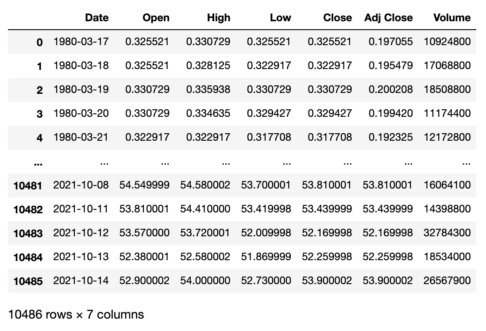
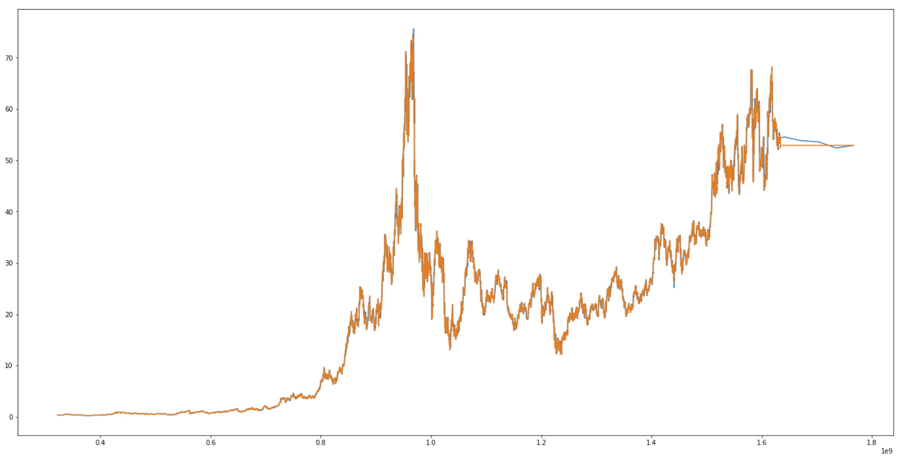

1. |ntel stock analysis
2. Intel stock forecast

Dataset structure:

The models accuracy:

 - Linear Regression (LR)
 - Lasso (LASSO)
 - Elastic Net (EN)
 - KNN (K-Nearest Neighbors)
 - CART (Classification and Regression Trees)
 - SVR (Support Vector Regression)
____
- LR : 0.693032 (0.022546)
- LASSO : 0.693032 (0.022546)
- EN : 0.693032 (0.022546)
- KNN : 0.998804 (0.000182)
- CART : 0.998538 (0.000311)
____

Dataset structure:

Conclusions:

- the forecasts are approximate
- do not take anomalies into account (eg. Covid)
- it's worth comparing with CNN or Revolut forecasts
- the algorithm evaluation loop allows you to choose the one with the greatest efficiency

https://money.cnn.com/quote/forecast/forecast.html?symb=intc#:~:text=Intel%20Corp%20(NASDAQ%3AINTC)&text=The%2034%20analysts%20offering%2012,the%20last%20price%20of%2053.91.