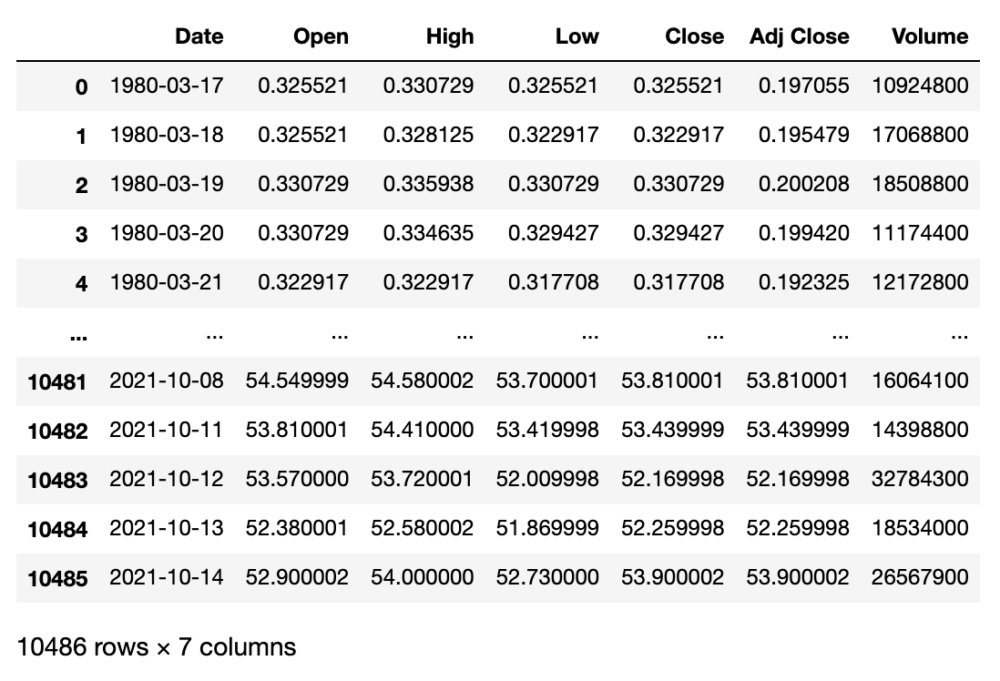

<h1>Repository for data analysis aggregation</h1>

<h2>15.10.2020</h2>

1. |ntel stock analysis
2. Intel stock forecast

Dataset structure:

The models accuracy:

 - Linear Regression (LR)
 - Lasso (LASSO)
 - Elastic Net (EN)
 - KNN (K-Nearest Neighbors)
 - CART (Classification and Regression Trees)
 - SVR (Support Vector Regression)
____
-  LR : 0.999999 (0.000000)
-  LASSO : 0.999999 (0.000000)
-  EN : 0.999999 (0.000000)
-  KNN : 1.000000 (0.000000)
-  CART : 1.000000 (0.000000)
